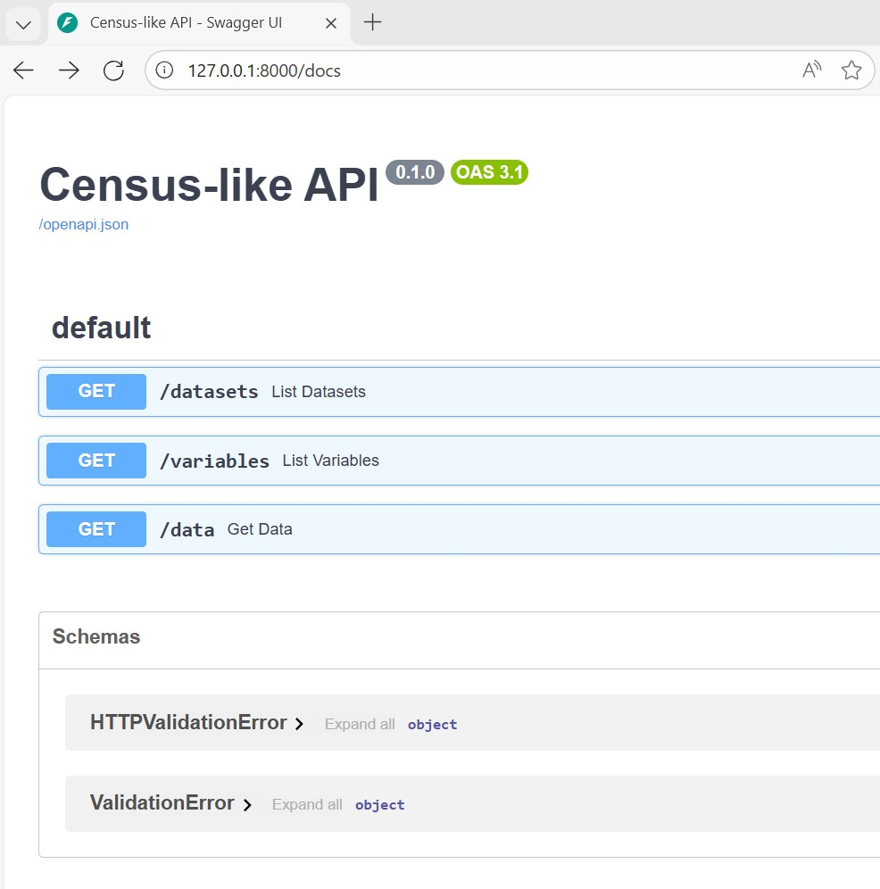

# Census‑Style API (Overview)
This project demonstrates a minimal API modeled after the U.S. Census Bureau's data service. It uses Python, FastAPI, and SQLite to provide REST endpoints for structured data queries.

## Key Features

### Endpoints:

- /datasets – lists available datasets
- /variables – lists variable metadata
- /data – query data using parameters like get, for, and time

### Data Flow:
- CSV ingestion → SQLite database → JSON responses

### Design Principles:
- Simple, local setup
- Census-style query pattern
- Auto-generated documentation via FastAPI (/docs)

## Why This Matters
Mimics the structure and behavior of the Census API for learning or custom deployments.
Provides a foundation for scaling to more complex datasets, adding geographies, and implementing API keys or rate limiting.

## How to run - in VSCode open Terminal
```python
# 1. Create and activate virtual environment
python -m venv .venv
source .venv/bin/activate      # Windows: .venv\Scripts\activate

# 2. Install dependencies
pip install -r requirements.txt  # Windows: pip install -r .\requirements.txt

# 3. Load sample data into SQLite
python ingest.py

#3.1 - data.db file created by ingest.py

# 4. Start the API server
uvicorn app:app --reload
```

# API will be available at: (Open Web Browser)
- API: `http://127.0.0.1:8000`
- Interactive docs: `http://127.0.0.1:8000/docs`
- Example query: `http://127.0.0.1:8000/data?get=POP,MEDIAN_INCOME&for=state:*`
- Press `CTRL+C` to quit





### Provenance
Nathanael Rosenheim used Microsoft Copilot LLM
- prompts
```
I am a regular census API data user. Briefly tell me what you know about Census API. 

I am interested in setting up a similar API for my own data. Give me a brief (simple) outline of what is needed to make something like this possible? I have no background in this area.

I am using python. How does the US Census store their data - are there references online that explain what type of SQL or flat file they use?

I would like to setup a very basic example using my local computer. I VS Code, GitHub, and I am proficient with python. Could you give me a very basic example of what to do?
```

Switched to VS Code and debugged with Claude Sonnet 4 agent

```
#codebase Please review the readme and my codebase and summarize what this demo project is designed to do

I have an error on the ingest.py file - any recommendations

when i run the command pip install -r requirements.txt - the requirements are not installed
```

Found several issues with code that were easy to fix